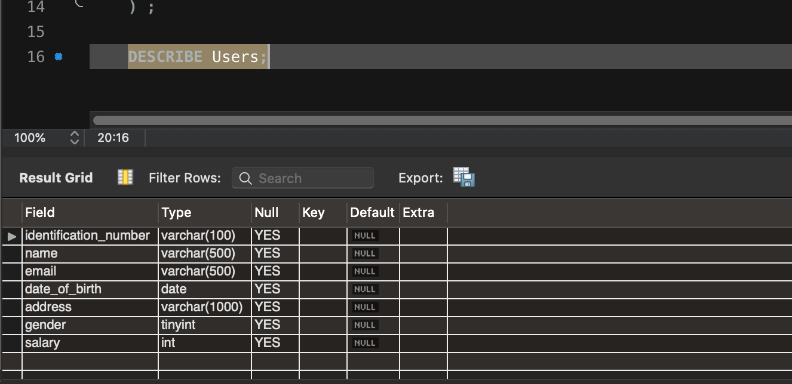

# DDL peldak:

## Adatbazison vegzett muveletek:
      
- **CREATE**: adatbazis letrehozasa      

    az elso adatbazisunkat mar letre is hoztuk korabban, most viszont mar tudjuk, hogy mit is jelent ez a parancs, igy fussunk is neki megegyszer

    ``` sql 
    CREATE DATABASE test_adatbazis;
    ```


<br>
<br>
probaljuk meg ujra megfuttatni ugyanezt a parancsot, ami hibat fog eredmenyezni, hiszen mar letezik ezen a neven egy adatbazis


"Cannot create database ... database already exists"

<br>
<br>
most probaljuk meg kiadni ismet, viszont az `IF NOT EXISTS` opcioval egyutt

``` sql 
CREATE DATABASE IF NOT EXISTS test_adatbazis;
```
igy mar csak egy figyelmeztetest (warningot) kapunk, nem pedig hibat: 

!! ez akkor lehet nagyon fontos, amikor nem vagyunk benne biztosak, h letezik-e mar az adatbazis es tobb utasitast akarunk egyszerre vegrehajtani <br>
ha tobb utasitas futtatasakor az egyik hibat dob, az utana kovetkezoek nem fognak megfutni, ha csak warning jon, akkor a futtatas meg nem szakad meg es lefuthat minden hiba nelkul

<br>
<br>

- **DROP**: adatbazis torlese    

most hogy csinaltunk egy adatbazist el is dobhatjuk/ki is torolhetjuk azt:

``` sql
DROP DATABASE test_adatbazis;
```

<br>

hasonloan a `CREATE DATABASE` - hez, ha ismet megfuttatjuk, akkor hibat kapunk, h az adatbazis mar nem letezik <br>
"Cannot drop database ... database does not exist"
<br>

ezt az `IF EXISTS` segitsegevel ki tudjuk vedeni, ilyenkor ha nem letezik az adatbazis, akkor csak warningot fogunk kapni, nem pedig errort

``` sql 
DROP DATABASE IF EXISTS test_adatbazis;
``` 

---    
## Tablakon vegzett muveletek:

- **CREATE**: tabla letrehozasa   
    ehhez a feladathoz keszitsunk egy kulon adatbazist
  
    ``` sql 
    CREATE DATABASE table_test;
    ```

    majd a konzolt valtsuk at erre az adatbazisra a `USE` segitsegevel (igy az osszes ezutan kiadot parancs, ezen az adatbazison fog lefutni)
    ``` sql 
    USE table_test;
    ```

    ezutan hozzuk letre az elso tablankat (7 db oszloppal, tobbfele tipus felhasznalasaval)

    ``` sql
    CREATE TABLE Users(
       identification_number VARCHAR(100), 
       name VARCHAR(500),
       email VARCHAR(500),
       date_of_birth DATE,
       address VARCHAR(1000),
       gender TINYINT,
       salary INT
    ) ;
    ``` 


   * identification_number: egy egyedi azonositokent hasznalna (kesobb ehhez hasznalhatjuk majd a UNIQUE, PRIMARY KEY es AUTOINCREMENT-t), mivel ez lenne a szemelyi szam, ami tartalmazhat betuket es szamokat, ezert a tipusa `VARCHAR` maximalis merete pedig 100 karakter
   * name: max 500 karakter hosszu szoveg  
   * email: max 500 karakter hosszu szoveg  
   * date_of_birth: datum tipusu, ido nelkul  
   * address: max 1000 karakter hosszu szoveg  
   * gender: tinyint, azaz -128 es 127 kozotti ertekeket vehet fel, akkor hasznaljuk, h ha csak par erteket vehet fel az oszlop, jelen esetben kettot, tolunk fugg, hogy melyik ketto lesz az <br>
   altalaban ez ugy nez ki, h 0 lesz a male (ferfi), 1 pedig a female (no)
   * salary: int, azaz 	-2147483648 es 2147483647 kozotti egesz szam lehet az erteke
 
 <br>
 
   a korabban emlitett `DESCRIBE` parancs segitsegevel is megnezhetjuk, hogy tenyleg letrejott-e minden oszlop:
   
   ``` sql 
   DESCRIBE Users; 
   ```
    

 <br>
 <br>
 <br>
 <br>
 
 **FELADAT**:
   (adatbazis, tabla, oszlopok nevei lehetnek magyarul, ekezet nelkul es kovetve azt, hogy tobb szo eseten _ az elvalaszto) 
   * uj adatbazis letrehozasa tetszoleges nevvel (a parancs akkor is futtathato legyen, ha az adatbazis mar letezett)
   * 2 uj tabla letrehozasa ebben az uj adatbazisban: 
        * Cimek tarolasara: tartalmazza az iranyitoszamot, utca nevet, varos nevet es hazszamot
        * Korabbi munkahelyek nyilvantartasara: tartalmazza a ceg nevet, betoltott pozicio nevet, kezdes es befejezes idejet (napra pontosan), eltoltott evek szamat (egesz szamok)  
 
 
 
 <br>
 
- **ALTER**: tabla modositasa   
    * **oszlop atnevezese** a tablaban
      nevezzuk at az `email` oszlopot `email_address`-re, illetve ezzel egyutt mozgassuk azt kozvetlenul az `identification_number` moge
        ```sql
        ALTER TABLE Users 
        CHANGE COLUMN email email_address VARCHAR(500)
        AFTER identification_number;
        ```     
  
      majd a `DESCRIBE Users;` parancs segitsegevel ellenorizzuk
      
    * **tabla atnevezese** <br> 
      nevezzuk at a tablat `Users`-rol `Felhasznalok`-ra 
      ``` sql
        ALTER TABLE Users
        RENAME TO Felhasznalok;    
      ```
      
      ha megprobaljuk lekerni a `Users` tabla strukturajat, akkor hibat kapunk, hiszen `Users` tabla nem letezik tobbe, csak `Felhasznalok`   
      ``` sql
        DESCRIBE Users;
      
        DESCRIBE Felhasznalok;
      ```
      
    * **oszlop torlese** a tablabol <br>
    toroljuk a tablabol az `email_address` oszlopot
        
    ``` sql
        ALTER TABLE Felhasznalok
        DROP COLUMN email_address;
  
        DESCRIBE Felhasznalok;
    ```
     
    * **oszlop(ok) hozzaadasa** a tablahoz <br>
    adjuk hozza a tablahoz ismet az `email` oszlopot
      ``` sql
        ALTER TABLE Felhasznalok
        ADD email INT;
      
        DESCRIBE Felhasznalok;
      ```  
    
    * **oszlop(ok) modositasa** a tablaban <br>
    rajottunk, hogy rossz az `email` tipusa, nem szamot, hanem szoveget szeretnenk tarolni, modositsuk az oszlop tipusat
    ``` sql
        ALTER TABLE Felhasznalok
        MODIFY email VARCHAR(500);
  
        DESCRIBE Felhasznalok;    
    ```   
  <br>
  <br>
  <br>
  
- **DROP**: tabla torlese           
  vegul toroljuk ki a tablankat  
  ```sql
  DROP TABLE IF EXISTS Felhasznalok;
  ```     
  
  
<br>     
<br>     
<br>     
        
tobbi oszlop es tabla szintu megszoritasrol peldak, illetve feladatok kesobb, a DML utasitasok utan     

