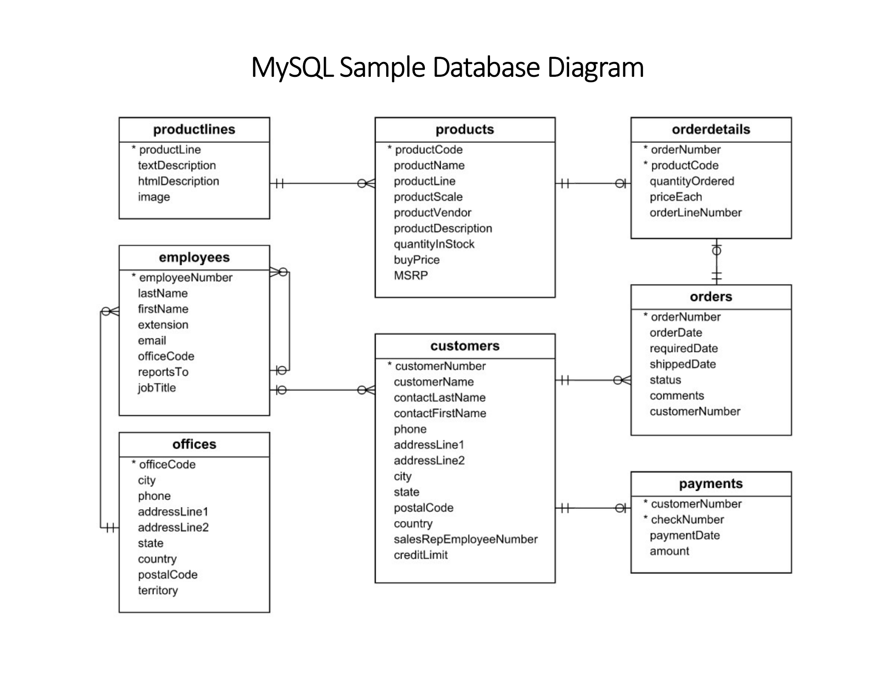

# DML utasitasok (halado):
      
      
----
    
# Gyakorlo adatbazis: 

1. https://sp.mysqltutorial.org/wp-content/uploads/2018/03/mysqlsampledatabase.zip szedjuk le az itt talalhato pelda filet
2. tomoritsuk ki
3. a kitomoritett filet nyissuk meg (alapertelmezetten a mysql workbenchben kellene megnyitnia, ha nem igy tortenik, akkor a tartalmat masoljuk ki es szurjuk be egy uj konzolba a workbenchen)
4. jeloljuk ki az osszes utasitast, majd futtassuk le
5. sema frissitese utan megjelenik az uj adatbazis `classicmodels` neven

  

- adatbazis model ertelmezese

    - a negyzetek a DB-ben talalhato tablak, elso sorai pedig a nevuk: productLines, products, orderDetails, employees, customers, orders, offices, payments
    - a nevuk alatt talalhato sorok pedig a bennuk talalhato oszlopnevek
    - csillaggal jelolt oszlopok az elsodlege kulcsok (`PRIMARY KEY`), ahol tobb oszlopnal is van * ott azok az oszlopok egyuttesen alkotjak a kulcsot pl: payments tabla, customerNumber es checkNumber
    - tablak kozotti vonalak a `FOREIGN KEY`-ek (kulso kulcsok)  
    pl: employees (alkalmazottak) tabla officeCode (iroda azonosito) oszlopa hivatkozik az Ofices (irodak) tabla officeCode oszlopara  
    tehat az employees tablaban csak olyan irodanak a kodjat rendelhetjuk hozza egy alkalmazotthoz, ami mar letezik az Offices tablaban
        
 
 ---
 
 ITT: reszletes utasitasok + peldak a DB-n