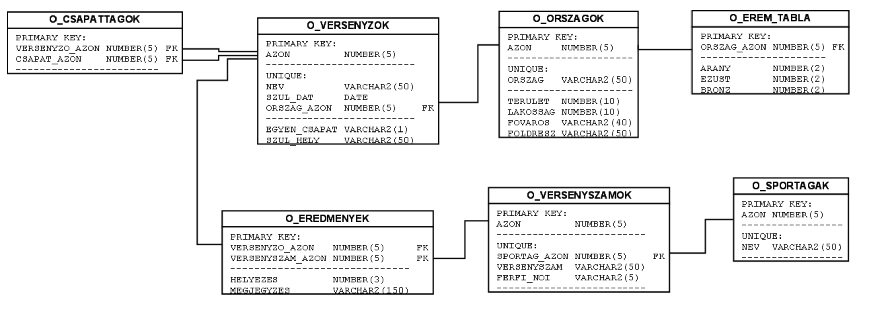

# DML utasitasok (halado):
      
    
#### A feladatokhoz a kovetkezo adatbazist fogjuk hasznalni: 

(a sema es az adatok oracle sql-bol lett atemelve, ezert a kepen levo tipusok elterhetnek, pl INT helyett NUMBER)


[olimpia adatbazis sema](https://github.com/szoti15/playground-7oc3549w/blob/master/sql/all_in_one.txt)

# SELECT


### select expression

- csak az itt felsorolt oszlopok adatait fogjuk latni
- legalabb egy oszlopot vagy `*`-ot kotelezo megadni
- tobb oszlop eseten, az oszlopneveket vesszovel elvalasztva felsoroljuk 
- specialis karakter `*`, ami megegyezik azzal, mintha felsorolnank az osszes oszlopot a tablabol
- a felsorolas sorrendjeben kapjuk vissza az eredmenyt

<br>

kerdezzuk le csak a versenyzok neveit:
``` sql 
    SELECT nev FROM O_VERSENYZOK;
```
eredmeny:
``` 
nev

'Adam Van Koeverden'
'Ana Maria Branza'
'Anasztaszja Szamuszevics'
'Andrea Minguzzi'
'Andrej Mojszejev'
'Andrejus Zadneprovskis'
'Aneta Konieczna'
'Anne-Laure Viard'
'Ara Abrahamian'
'Arn Gréta'
'Aubéli Ottó'
'Bácsi Péter'
'Baczkó Bernadett'
'Balog Gábor'
'Balogh Gábor'
'Barta Nóra'
'Beata Mikolajczyk'
'Bedák Pál'
...
```

<br>

most a versenyzok nevet es szuletesi helyet:
``` sql 
    SELECT nev, szul_hely FROM O_VERSENYZOK;
```
eredmeny:
``` 
nev                 szul_hely

'Arn Gréta',        'Budapest'
'Aubéli Ottó',      'Esztergom'
'Baczkó Bernadett', 'Budapest'
'Bácsi Péter',      'Budapest'
'Balog Gábor',      'Békéscsaba'
'Balogh Gábor',     'Budapest'
'Barta Nóra',       'Budapest'
'Bedák Pál',        'Budapest'
'Beé István',       'Budapest'
'Benedek Tibor',    'Budapest'
'Benkő Zoltán',     'Budapest'
'Berecz Zsombor',   'Budapest'
...
```


<br>

most a versenyzok minden adatat:
``` sql 
    SELECT azon, nev, orszag_azon, egyen_csapat, szul_hely FROM O_VERSENYZOK;
```

vagy:
``` sql 
    SELECT * FROM O_VERSENYZOK;
```

<br>
<br>

### DISTINCT

- az eredmenybol kiszuri a dupla sorokat
- fontos megjegyezni, h az "eredmeny" a felsorolt oszlopokra ertendoek, ha egy oszlop van csak akkor abbol szuri a dupla sorokat, ha ket oszlop van, akkor a ket oszlopbol egyuttesen lesz szurve

pl:

az osszes jelen levo orszag foldreszenek a nevet listazzuk, de egy folreszt csak egyszer
``` sql 
SELECT DISTINCT foldresz FROM O_Orszagok;
```

eredmeny:

```
foldresz

'Ázsia'
'Európa'
'Afrika'
'Észak- és Közép-Amerika'
'Ausztrália és Óceánia'
'Dél-Amerika'
```

ha a folresz mellett az orszag nevet is listazzuk es igy rakjuk ra a `DISTINCT` -et, akkor megkapjuk az osszes orszag es foldresz nevet,
hiszen minden foldreszhez egy orszag csak egyszer szerepel a tablaban (az orszag nevei egyebkent is egyediek):


``` 
SELECT DISTINCT foldresz, orszag FROM O_Orszagok;
``` 

<br>
<br>

### WHERE 

- az elobb bemutatott select kifejezessel az eredmenyben visszatero oszlopokat tudjuk meghatarozni, a `WHERE` segitsegevel pedig a sorokat tudjuk szurni
- a `WHERE` -nel megadott kifejezes a tabla minden sorara lefut, ahol pedig teljesul, ott a sor bekerul az eredmenybe
- a kifejezesnek logikainak kell lennie, azaz a kiertekelese utan egy igaz vagy hamis erteket kapunk
- tobb kifejezes osszekapcsolhato `AND` (es) es `OR` (vagy) operatorokkal, illetve a kifejezesek tetszolegesen egymasba agyazhatoak
- a tabla soraira ugy tudunk szurni, h hivatkozunk az oszlopban talalhato ertekre

``` sql 
SELECT * FROM O_Orszagok WHERE foldresz = 'Ausztrália és Óceánia';
```

eredmeny:
``` 
'Amerikai Szamoa (USA függő területe)'
'Ausztrália'
'Fidzsi-szigetek'
'Francia Polinézia (TOM)'
'Kiribati'
'Marshall-szigetek'
'Mikronézia'
'Nauru'
'Palau'
'Pápua Új-Guinea'
'Salamon-szigetek'
'Szamoa'
'Tonga'
'Tuvalu'
'Új-Zéland'
'Vanuatu'
'Wallis és Futuna (TOM)'
```

lekertuk az osszes resztvevo orszagot ami `Ausztrália és Óceánia` kontinensen helyezkedik el


<br>
<br>
<br>
<br>
<br>
<br>
<br>
<br>
<br>
<br>
<br>

TODO:
- OR AND
- LIKE, BETWEEN
- IS NULL
- egybeagyazas
https://it.inf.unideb.hu/honlap/adatbazis/olimpia


