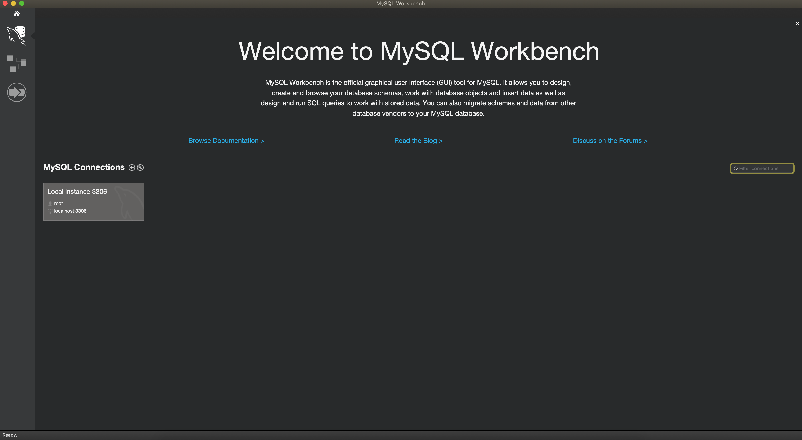
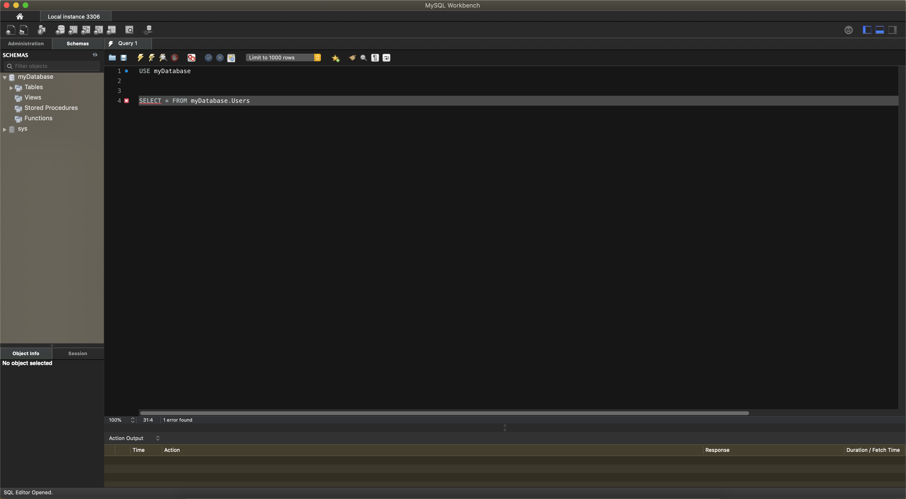
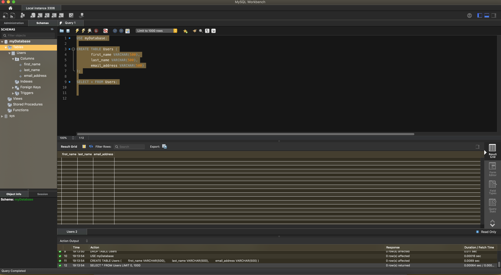

## mysql server
   * letoltese: https://downloads.mysql.com/archives/installer/ 
   * telepitesnel mehetunk a Custom-ra, ahol ki kell valasztanunk egy verziot a **server**ek kozul, illetve az applications allatt erdemes lehet a **mySql Workbenchet** hozzaadni meg
   * telepites soran a server konfiguracional, be lehet pipalni, h a server automatikusan induljon el windows indulaskor, erdemes lehet ezt bekapcsolva hagyni (igy nem kell minden egyes alkalommal elinditani kezzel a servert)
   * telepites soran ker a "root" userhez egy passwordot, ezt meg kell majd jegyezni
   * minden mas ertek maradhat default (pl port 3306)

## management tool
- az sql server eleresehez szukseg van egy management toolra, aminek a segitsegevel egyszeruen hozza tudunk ferni a serveren talalhato adatokhoz, tudjuk managelni magat a servert, ki tudjuk adni az sql utasitasokat    
- altban minden serverhez keszul egy hozza specifikusan gyartott tool: oracle - sql developer, mssql - management studio, mysql - **mysql workbench**
  es van nehany altalanos tool, ami tobb szerverhez is tud csatlakozni, pl: intellij idea, toad, stb... ezek ugy lehetsegesek, h ugynevezett sql drivereket hasznalnak a kulonbozo serverekhez

kezdeskent a mysql workbenchet fogjuk hasznalni, amit az elozo telepito soran fel is installaltunk 


## kapcsolodas a serverhez

a workbench megnyitasa utan, a kezdokepernyon egybol latjuk a serverunket, ami a localhoston fut es a 3306-os porton tudunk ra kapcsolodni


<br>
<br>

rakattintva felugrik a bejelentkezo ablak, jelenleg meg csak a **root** user letezik, aminek a jelszavat a telepiteskor allitottuk be, igy ezzel tudunk csak bejelentkezni
<br>
<br>
bejelentkezes utan mar csatlakoztunk is az sql serverunkhoz  



<br>
mysql-ben az adatbazist schema-kent is hivjak, igy bal oldalt a schema fulet kivalasztva atnavigalhatunk a serveren talalhato adatbazisok listajara

kezdetben csak a sys adatbazis letezik, ami a server szamara fentartott db, ebben altalaban nem dolgozunk

<br>
<br>

---
parancsok futtatasa console-bol:
egy utasitast a **;**-vel tudunk lezarni, ez viszont elhagyhato ha csak egy utasitast akarunk egyszerre futtatni

az utasitast(okat) kijeloljuk, majd az execute gombra kattintva futtatjuk (kis villam ikon felul, vagy egy shortcut segitsegevel: ctrl + shift + enter // egy parancs futtatasahoz ctrl + enter)


---

<br>
tudunk csinalni egy sajat **adatbazist** a kovetkezo parancscsal:

``` sql
CREATE DATABASE myDatabase;
```
igy el is keszitettuk az elso adatbazisunk (bal oldalt a schemas mellett talalhato refresh gombra kattolva meg is jelenik majd az adatbazisok listaja kozott)

 <br>
 a kozolunk jelenleg meg a sys adatbazisra mutat (a parancsokat abban az adatbazisban fogja kiadni), ahhoz hogy atvaltsunk a sajat adatbazisunkra, ahhoz a kovetkezo parancsot kell futtatnunk:

``` sql
USE myDatabase;
```

segitsegevel atvaltottunk a konzolunkban a myDatabase adatbazisunkra, innentol a tovabbi kiadott parancsok azon a DB-n fognak lefutni

<br>
<br>

a kovetkezo parancs segitsegevel letre is tudjuk hozni az elso tablankat, majd lekerdezni annak a tartalmat (ami persze ures lesz):

``` sql
CREATE TABLE Users (
       first_name VARCHAR(500),
       last_name VARCHAR(500),
       email_address VARCHAR(500)
);
   
SELECT * FROM Users;
```

mivel ;-vel le van zarva minden utasitas, igy ezeket akar egyszerre vagy kulon kulon is futtathatjuk a megfelelo sorrendben

