- mysql server:
    * letoltese: https://downloads.mysql.com/archives/community/ (187mb-os win valtozat)
    * telepites soran ki lehet pipalni, h a server automatikusan induljon el windows indulaskor, erdemes lehet bepipalni
    * telepites soran ker a "root" userhez egy passwordot, ezt meg kell majd jegyezni

- az sql server eleresehez szukseg van egy management toolra, aminek a segitsegevel egyszeruen hozza tudunk ferni a serveren talalhato adatokhoz, tudjuk managelni magat a servert, ki tudjuk adni az sql utasitasokat    
- altban minden serverhez keszul egy hozza specifikusan gyartott tool: oracle - sql developer, mssql - management studio, mysql - mysql workbench
  es van nehany altalanos tool, ami tobb szerverhez is tud csatlakozni, pl: intellij idea, toad, stb... ezek ugy lehetsegesek, h ugynevezett sql drivereket hasznalnak a kulonbozo serverekhez


- kezdeskent talan az idea a legegyszerubb: https://www.jetbrains.com/idea/download/#section=win (innen a community edition)
- fel kell telepiteni emg hozza a jdk-t: https://www.oracle.com/java/technologies/javase-jdk15-downloads.html (win x64)


(valszeg menet kozben lesz egy resz, h be kell allitani az sdk-t az ideanak, ez lehet, h a masodik lepes kornyeken lesz, itt majd meg kell adni a jdk elereset, ahova fel lett telepitve /program files/ valami...)


- ha meg nincs project, akkor az elso indulaskor lesz egy opcio, h new/project, ha mar van letezo project, akkor pedig innen lehet letrehozni:
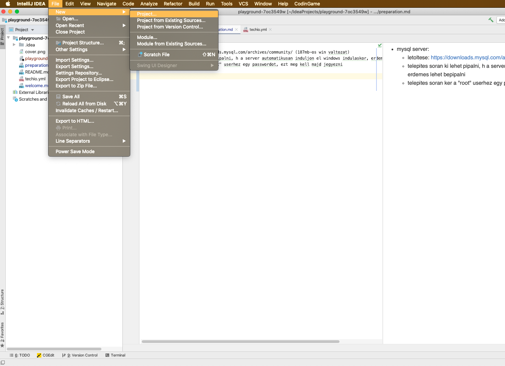
(alapvetoen az uj project Java-s project lesz, viszont trukkozunk es csak sql-es connectionokre hasznaljuk, barmilyen projectnel beallithato lenne, viszont igy lesz egy ures projectunk, amit csak sql eleresekre hasznalunk)

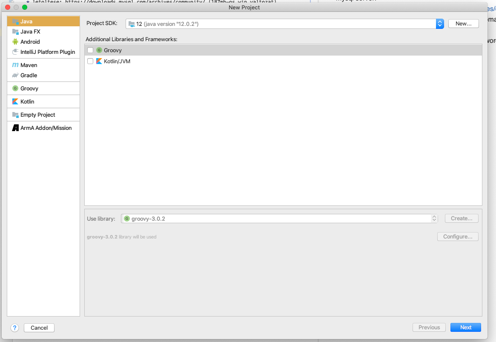

- projectet elnevezzuk, lehet barmi, de en databases-nek szoktam
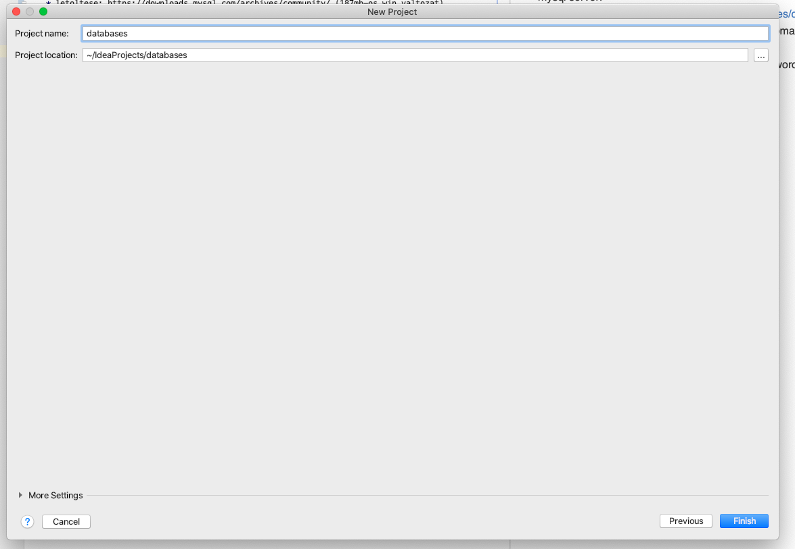

- csinalunk egy uj sql filet a projectunkben:
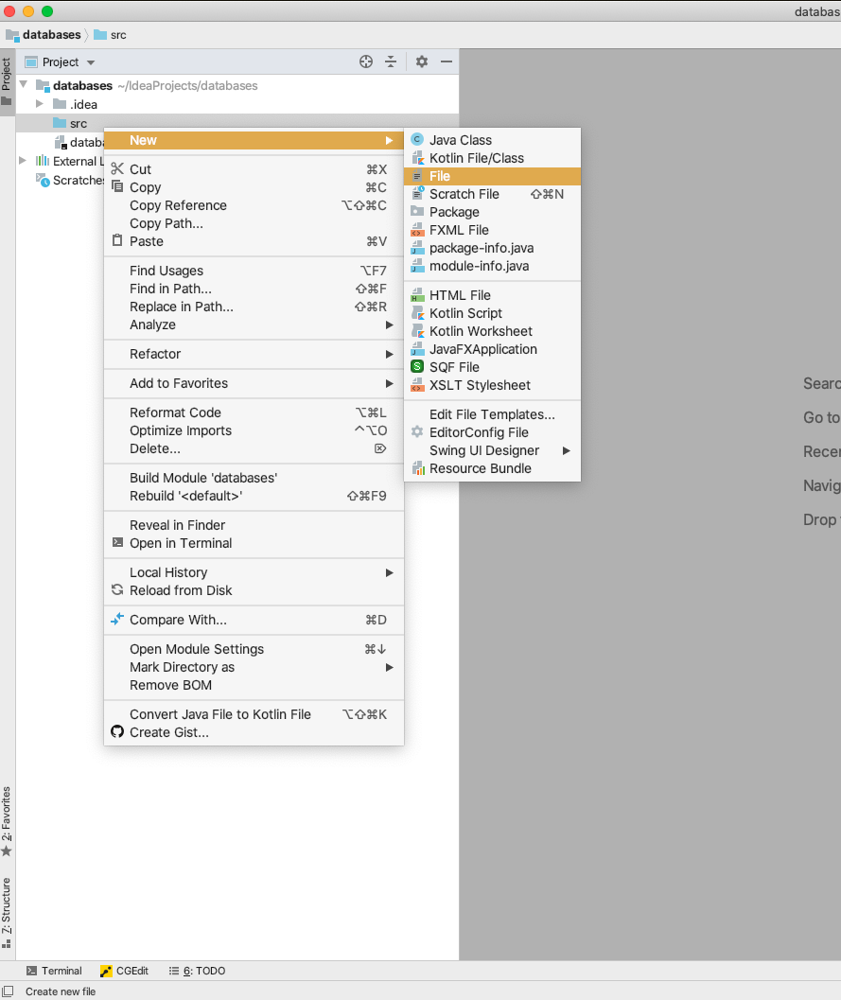
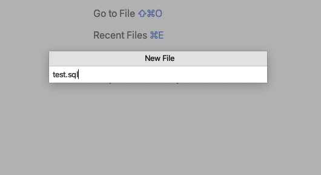


- ha meg nincs meg (7.01 folott), akkor fel kell raknunk az sql plugint (Database navigator)

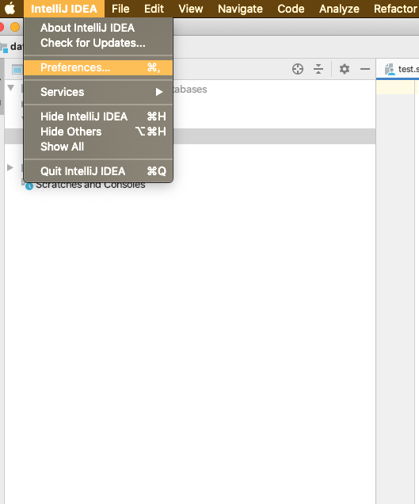
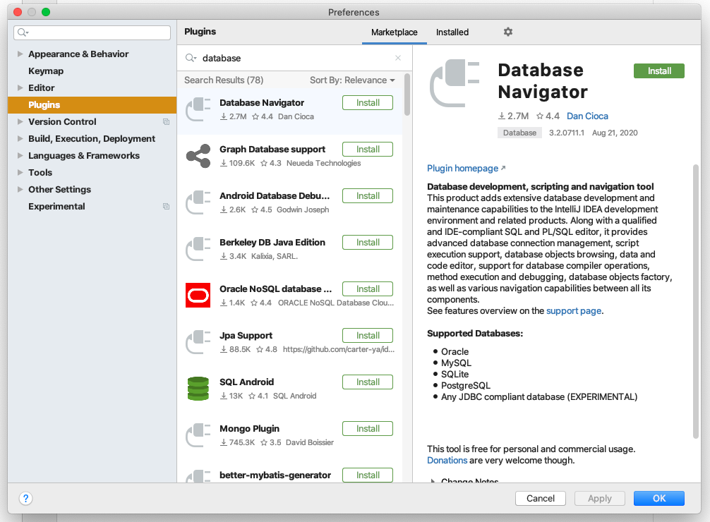
ezutan ker majd egy idea ujrainditast


- beallitjuk az elso connectiont a sajat gepunkon futo mysql serverhez: (lehet, h nem fent hanem valahol oldalt lesz a DB connectionos resz)
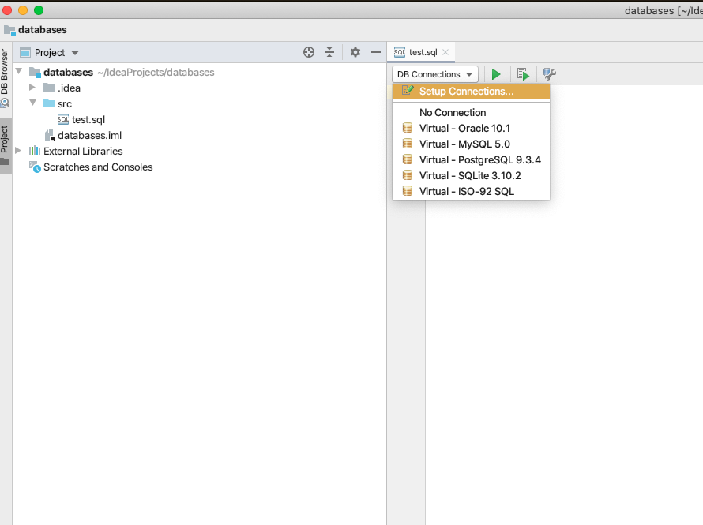
plusz jel, majd kivalasztjuk a server tipusat (olyan drivert fog hasznalni automatikusan)
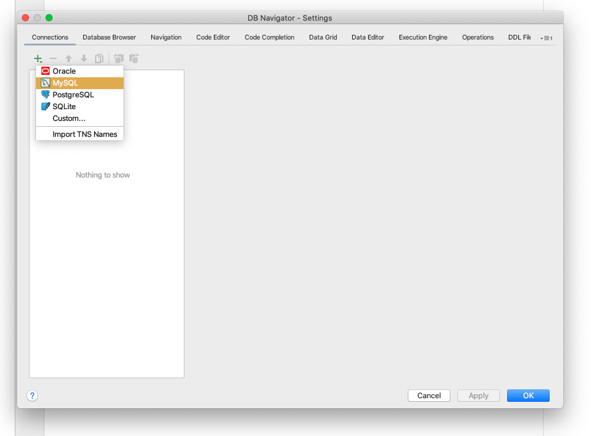
    * elnevezhetjuk valaminek a connectiont, semmi jelentosege nincs, nalam most mySql-connection lesz a neve
    * host: localhost (mivel a sajat gepunkon fut a server)
    * port 3306, ez az alapertelmezett, nem valtoztattunk rajta
    * database, maradhat mysql, mivel meg nem hoztunk letre mas adatbazist a serveren
    * user: root
    * password, amit az sql server telepitesekor megadtunk
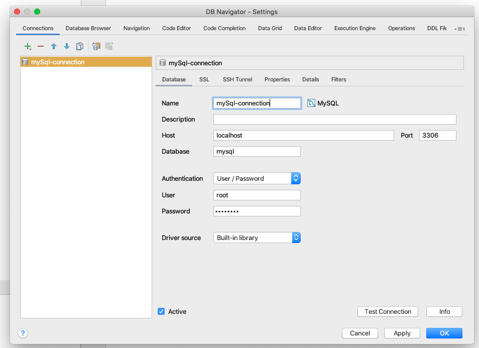
johet a test connection
ha hibat kapunk, pl: time zoneosat - Viki fog mert UTC van neki megadva, akkor ki kell javitani a kovetkezo modon:
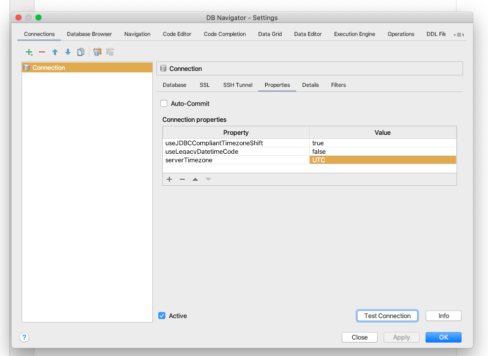


- megvan az elso kapcsolatunk a serverhez:
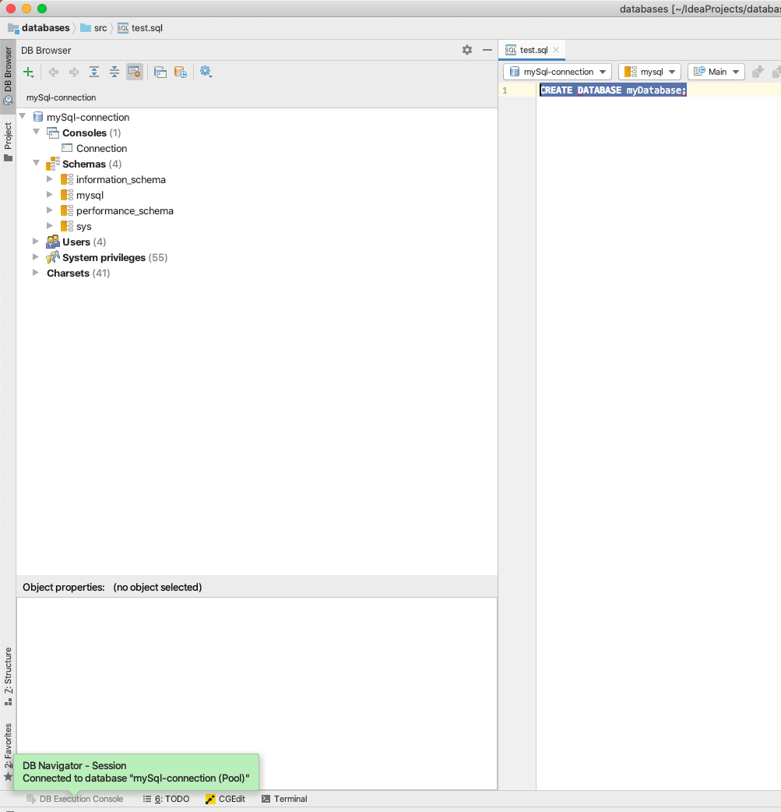

elso sql utasitasunk, amirol majd a kesobbiekben fogunk beszelni az a:
`CREATE DATABASE myDatabase`

myDatabase barmi lehet, az adatbazisunk neve lesz, CREATE DATABASE a parancs, amivel letrehozzuk. Miutan kijeloltuk a parancsot, fent a zold nyil (execute segitsegevel futtatjuk)
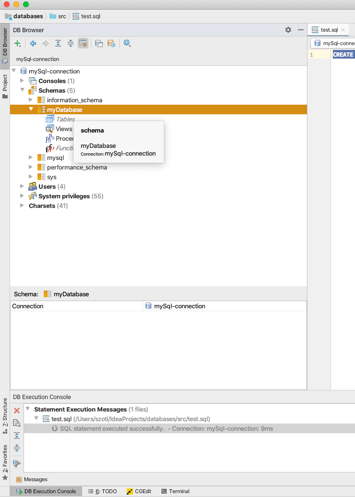

igy bal oldalt meg is jelent az uj adatbazisunk, ahol lathato, h a Tables alatt nem talalhato meg semmi

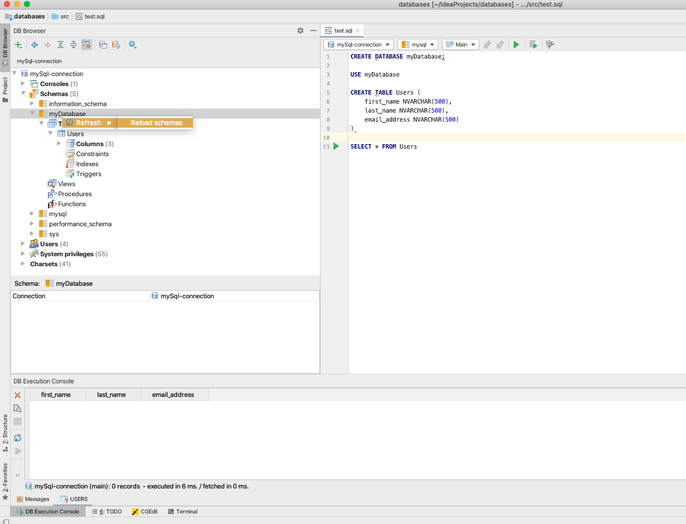

`USE myDatabase`


segitsegevel atvaltunk az ujonnan letrehozott adatbazisra, az ezutani parancsokat mar azon fogjuk kiadni

```
CREATE TABLE Users (
       first_name NVARCHAR(500),
       last_name NVARCHAR(500),
       email_address NVARCHAR(500)
)
   
SELECT * FROM Users
```

letrehozunk egy uj tablat es ki is olvassuk annak tartalmat, ami termeszetesen ures, hiszen egy friss ropogos tablarol van szo, adatok nelkul